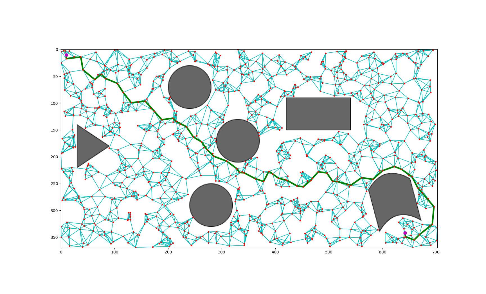

# Probabilistic Roadmap (PRM)

Given an image representing some configuration space, this script generates a
roadmap to facilitate in path planning between two valid positions.

Note that--in its current implementation--there is no enhancement phase after the
roadmap has been generated via a random sampling of the configuration space to
determine vertices, and a KNN search to form valid edges between vertices.

Additionally, no path smoothing has been included.
