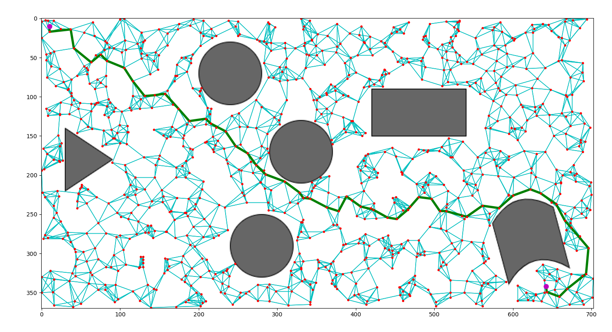

# Probabilistic Roadmap (PRM) and Rapidly-Exploring Random Trees (RRTs)

Given an image representing some configuration space, this script generates a
roadmap to facilitate in path planning between two valid positions. Two
different methods for roadmap generation are included: a classic PRM approach,
and a rapidly-exploring random tree (RRT) approach.

### PRM classic approach

### RRT approach

Note that there is no enhancement phase after the roadmap has been generated.
Additionally, no path smoothing has been included.
